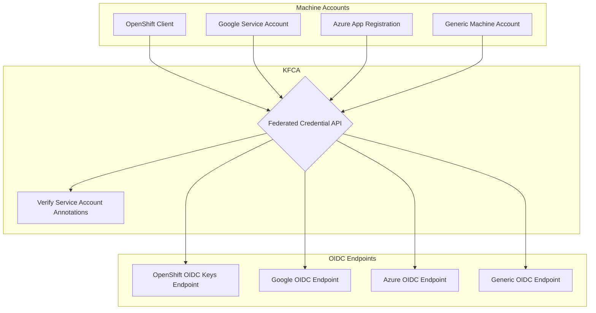

# Kubernetes Federated Credential Api

- [Kubernetes Federated Credential Api](#kubernetes-federated-credential-api)
  - [FlowChart](#flowchart)
  - [Build](#build)
    - [Other Notes](#other-notes)
  - [Usage](#usage)

## FlowChart



## Build

```bash
make goa-gen

export KO_DOCKER_REPO=""
make ko-build
```

### Other Notes

```bash
go install goa.design/goa/v3/cmd/goa@v3
go get goa.design/goa/v3/http@v3.16.0

mkdir -p k8s-federated-credential-api/design
cd k8s-federated-credential-api
go mod init k8s-federated-credential-api

~/go/bin/goa gen k8s-federated-credential-api/design
#~/go/bin/goa example k8s-federated-credential-api/design

go build -C cmd/kfca -o /tmp/kfca && /tmp/kfca
```

## Usage

Requesting a token for remote kubernetes service account.

Example of target service account annotation can be found in `examples/example.yaml`

```bash
export JSON='{
  "namespace": "smoke-tests",
  "ServiceAccountName": "default"
}'

curl --header "Authorization: Bearer $(kubectl create token default --duration=1h -n default)"\
  "http://localhost:8088/exchangeToken" -X POST \
  -H "Content-type: application/json" \
  -H "Accept: application/json" \
  -d "${JSON}" | jq
```
