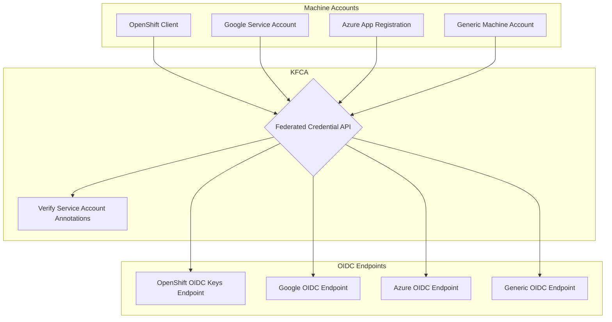

# Kubernetes Federated Credential API

- [Kubernetes Federated Credential API](#kubernetes-federated-credential-api)
  - [Overview](#overview)
  - [FlowChart](#flowchart)
  - [API Endpoints](#api-endpoints)
    - [`POST /exchangeToken`](#post-exchangetoken)
      - [Headers](#headers)
      - [Request Body](#request-body)
  - [Build](#build)
  - [Run](#run)
  - [Usage](#usage)
    - [curl](#curl)
    - [CLI](#cli)
  - [Configuration](#configuration)
    - [Service Account Annotations](#service-account-annotations)
  - [Deployment](#deployment)

## Overview

KFCA exchanges an incoming Kubernetes service account JWT for a token issued by a **different** Kubernetes cluster. The caller authenticates with a JWT from their home cluster, and KFCA verifies it against the OIDC issuer recorded in the target service account's annotations before minting and returning a new token.

## FlowChart



## API Endpoints

| Method | Path             | Description                                      |
| ------ | ---------------- | ------------------------------------------------ |
| POST   | `/exchangeToken` | Exchange an incoming JWT for a new cluster token |
| GET    | `/livez`         | Liveness probe — returns `{"live": true}`        |
| GET    | `/readyz`        | Readiness probe — returns `{"ready": true}`      |

### `POST /exchangeToken`

#### Headers

| Header          | Required | Description                       |
| --------------- | -------- | --------------------------------- |
| `Authorization` | Yes      | `Bearer <token>` — the source JWT |
| `Content-Type`  | Yes      | Must be `application/json`        |

#### Request Body

```json
{
  "namespace": "smoke-tests",
  "serviceAccountName": "default"
}
```

**Success Response** — `200 OK`

```json
{
  "status": {
    "token": "<base64-encoded-token>"
  }
}
```

## Build

```bash
# Build the server binary
make build

# Build and run
make run

# Build a container image with ko
export KO_DOCKER_REPO=""
make ko-build
```

## Run

```bash
# Default (listens on 0.0.0.0:8088)
/tmp/kfca

# Custom address and port
/tmp/kfca -http-addr 127.0.0.1 -http-port 9090
```

| Flag         | Default   | Description         |
| ------------ | --------- | ------------------- |
| `-http-addr` | `0.0.0.0` | HTTP listen address |
| `-http-port` | `8088`    | HTTP listen port    |

## Usage

### curl

```bash
export JSON='{
  "namespace": "smoke-tests",
  "serviceAccountName": "default"
}'

curl --header "Authorization: Bearer $(kubectl create token default --duration=1h -n default)" \
  "http://localhost:8088/exchangeToken" -X POST \
  -H "Content-Type: application/json" \
  -H "Accept: application/json" \
  -d "${JSON}" | jq
```

### CLI

A companion CLI client is provided in `cmd/kfca-cli`:

```bash
go build -C cmd/kfca-cli -o /tmp/kfca-cli

/tmp/kfca-cli \
  -url http://localhost:8088 \
  -token "$(kubectl create token default --duration=1h -n default)" \
  -namespace smoke-tests \
  -service-account default
```

| Flag               | Default               | Description                     |
| ------------------ | --------------------- | ------------------------------- |
| `-url`             | `http://0.0.0.0:8088` | Service URL                     |
| `-token`           | _(required)_          | Bearer token for authentication |
| `-namespace`       | _(required)_          | Target namespace                |
| `-service-account` | _(required)_          | Target service account name     |
| `-timeout`         | `30`                  | Request timeout in seconds      |

## Configuration

### Service Account Annotations

The target Kubernetes service account must carry one or more annotations whose key contains `kfca`. Each annotation value is a JSON object specifying the trusted OIDC issuer and expected subject:

```yaml
apiVersion: v1
kind: ServiceAccount
metadata:
  name: default
  namespace: smoke-tests
  annotations:
    kfca_1: '{ "issuer": "https://oidc.example.com", "subject": "system:serviceaccount:default:my-sa" }'
```

See `example/example.yaml` for a full example.

## Deployment

Kubernetes manifests are provided in the `deploy/` directory:

```bash
kubectl apply -f deploy/namespace.yaml
kubectl apply -f deploy/rbac.yaml
kubectl apply -f deploy/deployment.yaml
kubectl apply -f deploy/service.yaml
kubectl apply -f deploy/ingress.yaml
kubectl apply -f deploy/hpa.yaml
```
